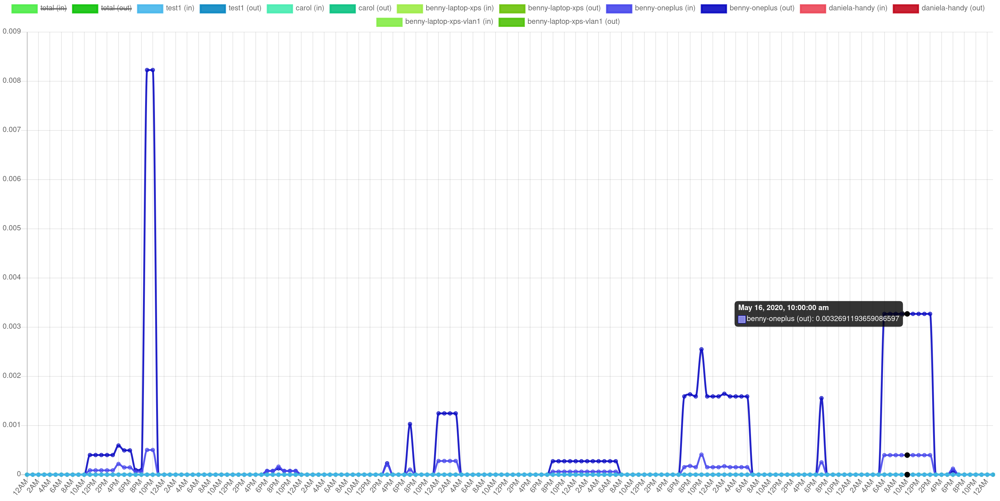

# WPA Enterprise - für zu Hause

---

## Warum?

- Fritzbox tut nicht mehr gut.
- LAN-Kabel damit Mumble geht...
- Wollte ich schon länger mal testen.

---

## Inhalt

1. [Hardware](#hardware)
2. [Software](#software)
3. [Was hat man davon?](#benefits)

---

<!-- .slide: id="hardware" -->


<!-- .element: style="height: 8em" -->

- USB 2.0, 300 Mbit, 17€
- Ralink RT5572
- Bewertung: Gut als AP mit RPi :-)
- Bild: [Amazon](https://www.amazon.de/gp/product/B00LLIOT34/)

---


<!-- .element: style="height: 8em" -->

- USB 3.0, 1200 Mbit, 17€
- RTL8812BU - [Kernel-Modul auf Github](https://github.com/cilynx/rtl88x2BU_WiFi_linux_v5.2.4.4_26334.20180126_COEX20171012-5044)
  - nein, danke...
- AP?
- Bild: [Amazon](mkagzTM2NufSHNY$/)

---

## Funktioniert das?

| settings            | laptop -> ap | ap -> laptop |
|---------------------|--------------|--------------|
| g                   |           24 |         25.5 |
| ht20-               |           91 |           86 |
| ht20+               |           92 |           87 |
| ht40-               |  2, 0.07, 16 |   10, 0.8, 2 |
| ht20-, w/ usb cable |            9 |           10 |

(Mbit, iperf 2, median of 3 measurements, 1-2m distance)

---

## Funktioniert das?

- Reichweite mit einem Client: exzellent.
- Mit 3 Clients immer noch besser als die Fritzbox (mit mehr Clients).
- Beste Einstellungen sind nicht offensichtlich.
  <br/>--> Testen.
- Gelegentlich einzelne Aussetzer im Mumble. Ursache noch unklar.

---

## Andere Hardware?

- Tausche Geld gegen Zeit - oder so.
- OpenWRT kann auch Radius.
- [UniFi anscheinend seit 2016](https://blog.ui.com/2016/11/04/managing-radius-authentication-unifi/)
- Viele andere auch, z.B. auch manche Switche.

---

<!-- .slide: id="software" -->

## Software


<!-- .element: style="border: none; background: none;" -->

---

## Meister des WLANs: hostap

- Verwaltet das WLAN
- Schwesterprojekt von `wpa_supplicant`

---

## hostap Konfiguration

```
# hardware
interface=wlp0s20f0u4
driver=nl80211

# wifi settings
ssid=subraum-legacy
hw_mode=g
channel=7
country_code=DE

# use fast wifi, please (802.11n)
ieee80211n=1
ht_capab=[HT20-]
wmm_enabled=1

# encryption
wpa=2
wpa_key_mgmt=WPA-EAP
ieee8021x=1 
auth_algs=1

# bridging
bridge=br0

# authentication
nas_identifier=abc

auth_server_addr=127.0.0.1
auth_server_port=1812
own_ip_addr=127.0.0.1

acct_server_addr=127.0.0.1
acct_server_port=1813

auth_server_shared_secret=abc
acct_server_shared_secret=abc
```

---

## Authentifizierung: FreeRadius

- mit Passwort oder Zertifikat
- Zertifikat für Server braucht man immer
- wichtig: nicht von öffentlicher CA!

---

```shell
$ nixos-option services.freeradius
This attribute set contains:
configDir
debug
enable
  --> huch, da war aber jemand faul?

$ find /nix/store/hvcl*-freeradius-3.0.20/etc/raddb/ \
    -type f -exec cat {} \+ | wc -l
25159
  --> oh...

$ grep '^[+-]\s' /etc/nixos/wifi-ap-eap/config.patch | wc -l
65
```

---

## Was habe ich geändert?

- Zertifikate: Lebensdauer 60d -> 10y, Beispiel-Namen, CRL an
- Pfade: z.B. Shared-Secret nicht in `/nix/store`
- `check_cert_cn = %{User-Name}`
- EAP an, TLS-Cache an, SQL an
- weniger Prozesse

---

## Authentifizierung: Was ich dabei gelernt habe.

- Client weiß nur "EAP" - der Rest muss vom Nutzer kommen.
- FreeRadius kann diverse Auth-Methoden - und rät, welche der Client gerade spricht.
- "TLS" ist für Zertifikat, "TTLS" ist für Passwort (durch TLS-Tunnel).

---

## Geht das nicht einfacher?

- Für euch ja - wenn ihr NixOS benutzt.
- Ich habe da mal was gebaut: [siehe Gitlab](https://git.c3pb.de/snowball/nixos-config-for-routeromen/-/tree/master/wifi-ap-eap)
- Git klonen, z.B. nach `/etc/nixos/snowball`
- NixOS-Konfiguration anpassen (nächste Folie)
- Clients eintragen

---

## NixOS Konfiguration

```nixos
imports = [./snowball/wifi-ap-eap/default.nix];
networking.bridges.br0.interfaces = ["enp4s0"];
networking.interfaces.br0 = { ... };  # IP address, etc.

services.hostapd = {
  enable = true;
  interface = "wlp0s20f0u4";
  ssid = "abc";
  channel = 7;
  extraConfig = ''
    bridge=br0
    # use fast wifi, please (802.11n)
    ieee80211n=1
    ht_capab=[HT20-]
    wmm_enabled=1

    # verbose logging
    #logger_stdout_level=0
  '';
};
services.wifi-ap-eap = {
  enable = true;
  countryCode = "DE";
  serverName = "ap.example.com";
  serverCertValidDays = 3650;
  clientCertValidDays = 3650;
};
#services.freeradius.debug = true;
```

---

## Clients eintragen

```shell
# cat /etc/wifi-ap-eap/users
alice Cleartext-Password := "Passwort"
bob Crypt-Password := "Pk54PQ1e4R3RY"

# radcrypt --des Passwort
Pk54PQ1e4R3RY

# nixos-wifi-ap-eap client add carol
Password for new key: Passwort
...
Certificate has been stored in carol.zip

# nixos-wifi-ap-eap client test carol.zip
Archive:  carol.zip
  inflating: README.txt
  inflating: ap.verl.bbbsnowball.de.pem
  inflating: ap.verl.bbbsnowball.de.der
  inflating: ap.verl.bbbsnowball.de.crt
  inflating: carol.p12
  inflating: carol.pem
Password for user key:
...
SUCCESS

# nixos-wifi-ap-eap client list
No.  Type    Username                        Email                                               Status
---  ----    --------                        -----                                               ------
10:  client  carol                           carol@ap.verl.bbbsnowball.de                        valid until 300514212028Z

# nixos-wifi-ap-eap client revoke carol
Revoke 10.pem?
  V     300514212028Z           10      unknown /C=DE/ST=Radius/O=Example Inc./CN=carol/emailAddress=carol@ap.verl.bbbsnowball.de
Revoke? [y/n] y

# nixos-wifi-ap-eap client listcrl
Certificate Revocation List (CRL):
    ...
Revoked Certificates:
    ...
    Serial Number: 10
        Revocation Date: May 16 21:23:49 2020 GMT

# nixos-wifi-ap-eap client list
No.  Type    Username                        Email                                               Status
---  ----    --------                        -----                                               ------
10:  client  carol                           carol@ap.verl.bbbsnowball.de                        valid until 300514212028Z
```

---

## Abschweifung: eapol_test

- Testet ein Login direkt mit dem Radius-Server.
- "Unfortunately it's not usually packaged and can be quite challenging to build manually." [Quelle](https://wiki.freeradius.org/guide/eduroam)

---

## Abschweifung: eapol_test

```nixos
{ pkgs ? import <nixpkgs> {} }:
pkgs.wpa_supplicant.overrideAttrs (old: rec {
  pname = "eapol_test";
  name = "${pname}-${old.version}";
  patches = [ ./eapol_test--secret-from-env.patch ];
  makeFlags = "eapol_test";
  installPhase = ''
    mkdir $out $out/bin
    install eapol_test $out/bin/
  '';
})
```

---

<!-- .slide: id="benefits" -->


## Was hat man davon?

- Geräte wieder aussperren
- Accounting
- VLAN

---

## Accounting



---

## Accounting


---

## Accounting

- Logins und übertragene Daten in SQLite
- Anzeige bei mir mit CherryPy und chart.js
- Zeitliche Auflösung eher mäßig, weil für Abrechnung gedacht.
- Optional: Gerät sperren, wenn Volumen aufgebraucht.

---

## VLAN

- Nicht jeder Client muss im gleichen Netzwerk landen.
- FreeRadius gibt VLAN ID vor.
- Konfiguration in `users` Datei oder Datenbank.
- hostap erstellt ein eigenes Interface dafür.
- Das kann man auch kreativ nutzen, z.B. iptables/ebtables statt VLAN.
- Funktioniert auch mit OpenWRT etc - dann aber nur VLANs.

---

## VLAN

```shell
# grep vlan /etc/wifi-ap-eap/hostapd.conf 
dynamic_vlan=1
vlan_bridge=br0
vlan_file=/etc/nixos/wifi-ap-eap/all-vlans-on-br0.cfg

# cat /etc/nixos/wifi-ap-eap/all-vlans-on-br0.cfg
*  wifiap.#  br0

# cat /etc/wifi-ap-eap/users 
benny-laptop-xps-vlan1
                        Tunnel-Type := 13,
                        Tunnel-Medium-Type := 6,
                        Tunnel-Private-Group-ID := "2"

# sqlite3 /var/lib/radiusd/freeradius.db 'select * from radgroupreply;'
1|testgroup|Tunnel-Type|:=|13
2|testgroup|Tunnel-Medium-Type|:=|6
3|testgroup|Tunnel-Private-Group-ID|:=|"42"

# sqlite3 /var/lib/radiusd/freeradius.db 'select * from radusergroup;'
1|test1|testgroup|1

# ip a
16: wlp0s20f0u4: <BROADCAST,MULTICAST,UP,LOWER_UP> mtu 1500 qdisc mq master br0 state UP group default qlen 1000
    ...
76: wifiap.2: <BROADCAST,MULTICAST,UP,LOWER_UP> mtu 1500 qdisc mq master br0 state UNKNOWN group default qlen 1000
    ...

# ebtables -I INPUT --in-if wifiap.2 -j mark --set-mark 2 --mark-target CONTINUE
# iptables -A INPUT -i br0 -p tcp -m tcp --dport 1235 -m mark --mark 0x2/0x2 -j ACCEPT
```

---

<!-- .slide: id="results" -->


```nix
xyz
```
